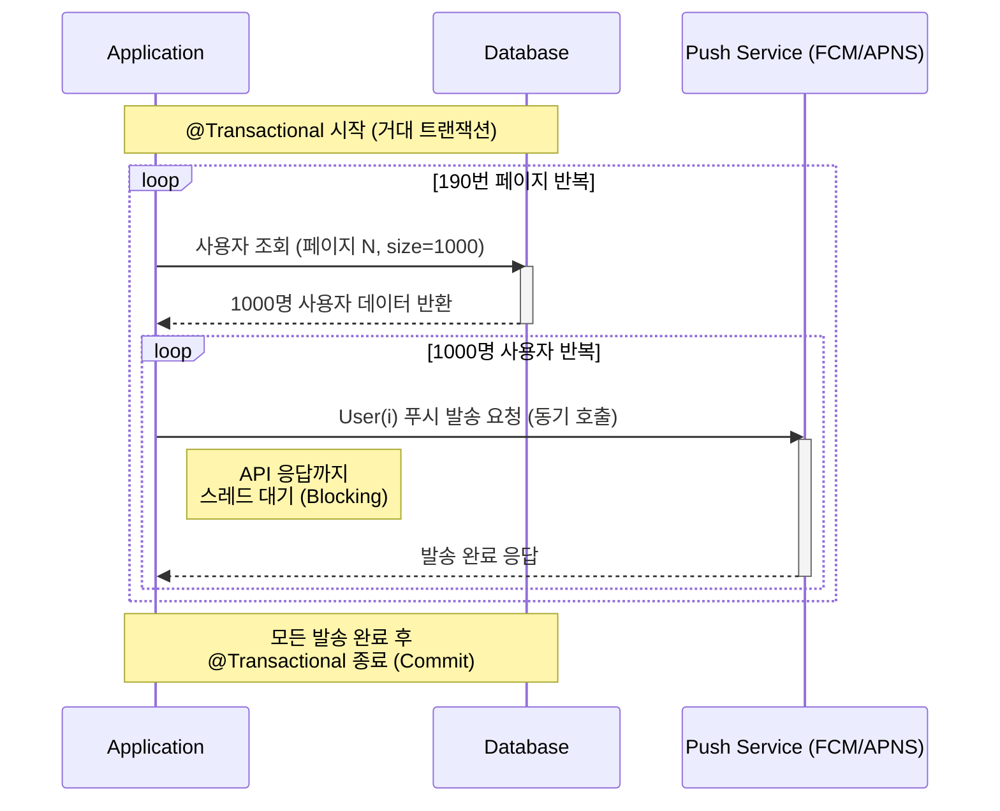
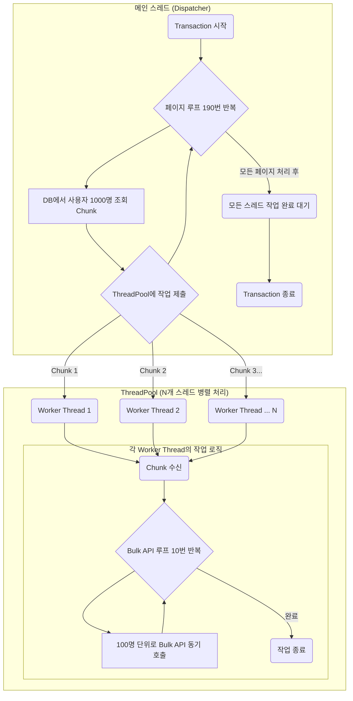
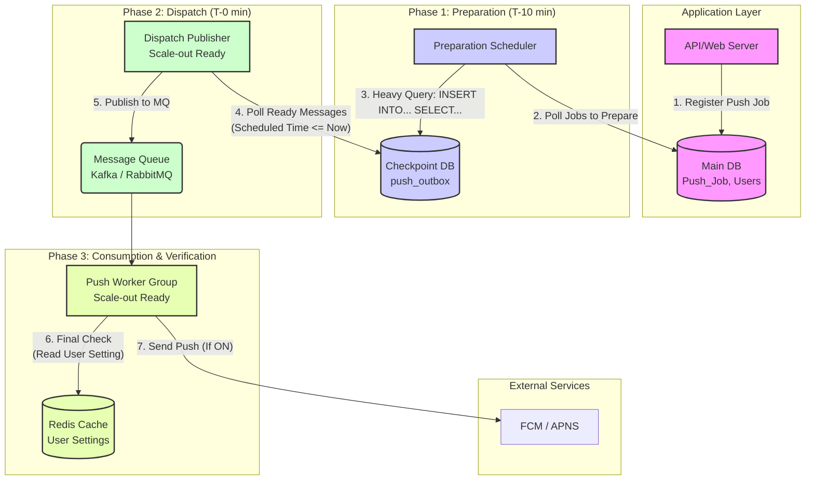

## 1. 도입

대규모 사용자 기반을 가진 애플리케이션에서 푸시 알림 시스템은 사용자 참여를 유도하고 중요한 정보를 전달하는 핵심적인 역할을 수행한다. 그러나 사용자 수가 증가함에 따라, 시스템은 대량의 메시지를 안정적이고 신속하게 처리해야 하는 기술적 과제에 직면하게 된다. 본 글에서는 과거 대규모 푸시 알림 시스템의 성능을 ThreadPool을 이용한 병렬 처리로 개선했던 경험을 복기하고, 당시의 기술적 한계를 현재의 관점에서 재평가하여 이를 극복하기 위한 새로운 아키텍처를 제안하고자 한다. 본 연구의 목표는 메시지 큐(Message Queue)와 아웃박스 패턴(Outbox Pattern)을 기반으로 한 차세대 비동기 처리 모델을 설계하여, 시스템의 처리량(Throughput), 안정성(Stability), 그리고 확장성(Scalability)을 획기적으로 개선하는 방안을 탐구하는 데 있다.

## 2. 기존 시스템의 문제 정의

본 연구의 대상이 되는 기존 시스템은 19만 명의 전체 사용자에게 알림을 발송하는 데 5시간 이상이 소요되는 성능 문제를 내포하고 있었다.

### 2.1. 1차 시스템: 단일 스레드 기반 동기 처리 모델

1차 시스템의 아키텍처는 단일 스레드가 페이징(Paging) 기법으로 사용자 정보를 순차 조회하고, 외부 푸시 서비스 API(e.g., FCM, APNS)를 동기적으로 호출하는 구조이다. 특히, 전체 발송 프로세스가 단일 데이터베이스 트랜잭션 내에서 실행되는 특징을 가진다.

이러한 구조는 다음과 같은 명확한 한계를 내포한다.

- 문제점 1: 직렬 처리와 동기 I/O 병목
각 API 호출마다 발생하는 I/O 대기 시간(Blocking)이 누적되어 전체 프로세스의 극심한 성능 저하를 유발한다.
- 문제점 2: 초장기 트랜잭션 (Long-Lived Transaction)
프로세스가 실행되는 수 시간 동안 데이터베이스 리소스에 장시간 락(Lock)이 설정될 수 있으며, 이는 시스템의 다른 부분에 대한 가용성 문제를 야기할 수 있다.
- 문제점 3: 구조적 취약성
단일 트랜잭션 모델은 프로세스 중간에 발생하는 단 한 번의 예외에도 전체 작업이 롤백(Rollback)되는 결과를 초래하여, 시스템의 안정성과 신뢰도를 저해한다.

### 2.2. 2차 시스템: 스레드 풀 기반 병렬 처리 모델

1차 시스템의 성능 한계를 극복하기 위해, 2차 시스템에서는 두 가지 핵심적인 최적화를 적용하였다. 가장 결정적인 개선은 외부 API의 Bulk 처리 방식 도입으로, 이는 네트워크 호출 횟수를 99% 이상 감소시켜 I/O 대기 시간을 획기적으로 줄였다. 이에 더하여, 스레드 풀(Thread Pool)을 이용한 병렬 처리 모델을 적용하여 최적화된 작업을 동시에 수행하도록 하였다.

#### 아키텍처:
1. (Bulk API 적용) 기존의 단일 사용자 호출 방식에서, 100명 단위로 푸시를 일괄 발송할 수 있는 Bulk API를 호출하는 방식으로 로직을 변경한다.
2. (병렬 처리) 시스템의 CPU 코어 수에 맞춰 스레드 풀을 생성하고, 메인 스레드가 조회한 사용자 청크(Chunk)를 각 작업 스레드에 할당하여 Bulk API 호출을 병렬로 실행한다.

이러한 병렬 처리 모델 도입을 통해, 시스템의 총 발송 시간은 5시간에서 30분으로 유의미하게 단축되었다.

#### 한계점:
성능 개선에도 불구하고, 2차 시스템은 여전히 1차 시스템과 동일한 근본적인 한계를 공유한다.

 - 문제점 1: 초장기 트랜잭션 및 DB 병목 지속
전체 발송 프로세스는 여전히 단일 트랜잭션 내에서 실행된다. 다수의 스레드가 동시에 데이터베이스의 공유 리소스에 접근하면서 경합이 발생하고, 이는 전체 처리량을 저하시키는 병목 현상을 유발하며, 초장기 트랜잭션 문제 또한 해결되지 않았다.
 - 문제점 2: 제한적인 확장성 (Vertical Scaling)
 성능은 단일 서버의 CPU 코어 수와 스레드 풀의 크기에 직접적으로 의존한다. 처리량을 높이기 위해서는 서버의 사양을 높여야 하는 수직적 확장(Vertical Scaling)만 가능하며, 여러 서버로 부하를 분산하는 수평적 확장(Horizontal Scaling)이 어려운 구조이다.
 - 문제점 3: 여전한 강한 결합도
 애플리케이션이 푸시 발송이라는 무거운 작업을 직접 수행하는 구조는 변하지 않았다. 이는 시스템의 복잡도를 높이고, 외부 API의 응답 지연이 스레드 풀 전체의 성능에 영향을 미치는 등 여전히 강한 결합도(Tight Coupling) 문제를 내포한다.

## 3. 제안하는 아키텍처: 비동기 메시지 기반 분산 처리 모델

기존 시스템의 한계를 극복하기 위해, 본 연구에서는 단순히 속도 개선을 넘어 **시스템의 안정성(Reliability), 확장성(Scalability), 데이터 정확성(Accuracy)**까지 확보하는 것을 목표로 새로운 아키텍처를 제안한다.

핵심 전략은 시간이 오래 걸리는 '준비(Preparation)' 단계와 신속해야 하는 '발사(Dispatch)' 단계를 명확히 분리하고, 각 단계의 역할을 전문화된 컴포넌트에 위임하는 것이다. 전체 시스템의 구성은 아래 다이어그램과 같다.

### 3.1. 1단계: 준비 (Preparation) - 안정적인 체크포인트 생성

정시성이 중요한 예약 발송 시스템에서, 발송 시점에 대규모 데이터를 조회하는 것은 지연을 유발할 수 있다. 이 문제를 해결하기 위해, **주기적으로 실행되는 '준비 스케줄러(Preparation Scheduler)'** 를 도입한다.

이 스케줄러는 매 분마다 실행되며, **"지금부터 10분 이내에 발송되어야 하지만, 아직 '준비' 상태가 아닌 작업"** 이 있는지 데이터베이스에 질의한다. 해당 작업을 찾으면, 다른 스케줄러 인스턴스가 동일한 작업을 중복으로 처리하는 것을 방지하기 위해, 해당 작업의 상태를 'PREPARING'으로 변경하는 것을 포함한 조회 과정을 원자적으로(atomically) 실행한다. (SELECT ... FOR UPDATE 구문 등을 활용).

성공적으로 작업을 선점하면, 메인 DB(필요시 Read Replica DB 사용)에 복잡한 타겟팅 조건을 포함한 INSERT INTO ... SELECT 쿼리를 실행하여 그 결과를 push_outbox 테이블에 생성한다. 이 push_outbox 테이블은 단순한 데이터 저장소를 넘어, 실패 시 안전하게 재개할 수 있는 '체크포인트(Checkpoint)' 역할을 수행한다.

이 타겟팅 프로세스와, 작업이 모두 완료된 후 Push_Job의 상태를 'PREPARED'로 최종 변경하는 과정은 반드시 하나의 원자적 트랜잭션(a single atomic transaction)으로 실행되어야 한다. 이는 데이터의 정합성을 보장하는 핵심적인 장치로, 만약 push_outbox 생성 중 오류가 발생하면 작업 상태가 변경되지 않아 시스템이 안전하게 이전 상태로 롤백됨을 의미한다.

**[동작 로직 요약]**

- Trigger: 매분 실행 (@Scheduled(cron = "0 * * * * *"))
- Query: SELECT * FROM Push_Job WHERE status = 'SCHEDULED' AND scheduled_time <= NOW() + INTERVAL '10 MINUTE'
- Action (Atomic Transaction):
  1. 작업 상태를 PREPARING으로 변경 (작업 선점)
  2. INSERT INTO push_outbox SELECT ... 실행
  3. 작업 상태를 PREPARED로 변경

### 3.2. 메시지 큐를 이용한 작업 분산 및 버퍼링

데이터베이스를 작업 큐로 사용하는 방식에서 탈피하여, Kafka 또는 RabbitMQ와 같은 메시지 큐 시스템을 도입한다. 별도의 CDC(Change Data Capture) 프로세서 또는 스케줄러가 `push_outbox` 테이블의 변경 사항을 감지하여 메시지 큐에 작업을 발행(Publish)한다.

- 플랫폼별 Topic 분리: FCM, APNS 등 플랫폼의 이질성을 고려하여, 각 플랫폼에 해당하는 별도의 Topic으로 메시지를 발행한다. (push-fcm-topic, push-apns-topic) 이는 특정 플랫폼의 장애가 다른 플랫폼으로 전파되는 것을 방지하고, 독립적인 확장을 가능하게 한다.

### 3.3. 수평 확장이 가능한 소비자 그룹 (Consumer Group)

각 Topic의 메시지는 독립된 소비자(Consumer) 그룹에 의해 처리된다. 소비자 인스턴스의 수를 조절하는 것만으로 전체 시스템의 처리량을 탄력적으로 조절할 수 있어, 수평적 확장성(Horizontal Scalability)을 확보한다.

### 3.4. 트래픽 분산을 통한 안정성 확보

대규모 푸시 발송으로 인한 동시 접속 부하를 제어하기 위해, 사용자 그룹핑 전략을 적용한다. user_id를 해싱(e.g., user_id % N)하여 사용자를 N개의 그룹으로 균등하게 분배하고, 그룹별로 시차를 두어 푸시를 발송함으로써 서버 부하를 완만하게 제어한다.

## 4. 시스템의 견고성(Robustness) 확보 방안

외부 시스템 연동 시 발생 가능한 실패 상황에 대응하기 위한 전략은 다음과 같다.

    지수 백오프 기반 재시도 (Exponential Backoff Retry): 일시적인 오류(e.g., 5xx HTTP Status)에 대해, 재시도 간격을 점진적으로 늘려가는 지수 백오프 알고리즘을 적용하여 시스템의 불필요한 부하를 방지한다.

    데드 레터 큐 (Dead Letter Queue, DLQ): 지정된 횟수 이상 재시도에 실패한 메시지는 별도의 DLQ로 격리하여, 실패 원인 분석 및 후속 조치를 위한 데이터를 확보한다.

## 5. 결론 및 논의

본 글에서 제안한 메시지 큐 기반의 비동기 아키텍처는 기존 시스템의 DB I/O 병목 문제를 해결하고, 각 컴포넌트의 독립적인 확장을 가능하게 하여 대규모 트래픽에 효과적으로 대응할 수 있는 기반을 마련한다. 또한, 실패 처리 메커니즘을 통해 시스템의 안정성과 데이터 무결성을 보장한다.

물론, 제안된 아키텍처는 메시지 큐 도입에 따른 운영 복잡성 증가 및 최종 일관성(Eventual Consistency) 모델에 대한 이해가 필요하다는 트레이드오프가 존재한다. 그럼에도 불구하고, 비즈니스의 성장에 따라 유연하게 확장할 수 있는 기술적 토대를 마련한다는 점에서 그 효용성은 매우 높다고 판단된다. 향후 연구로는 각 플랫폼별 최적의 Bulk 처리 단위 및 소비자 인스턴스 개수를 산출하기 위한 성능 벤치마크 테스트가 필요하다.