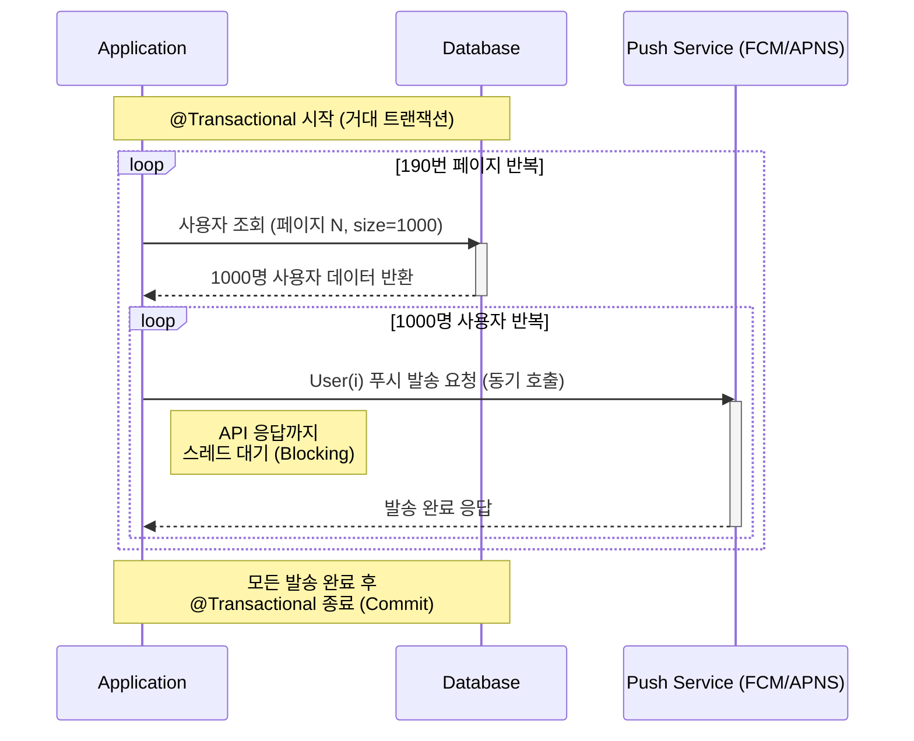
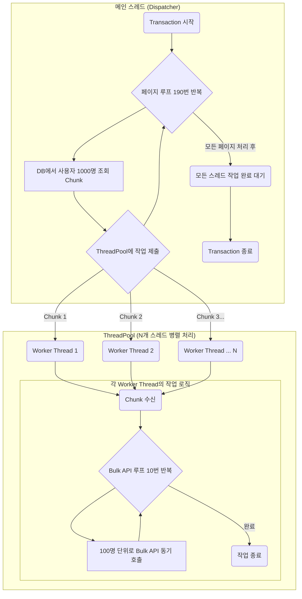
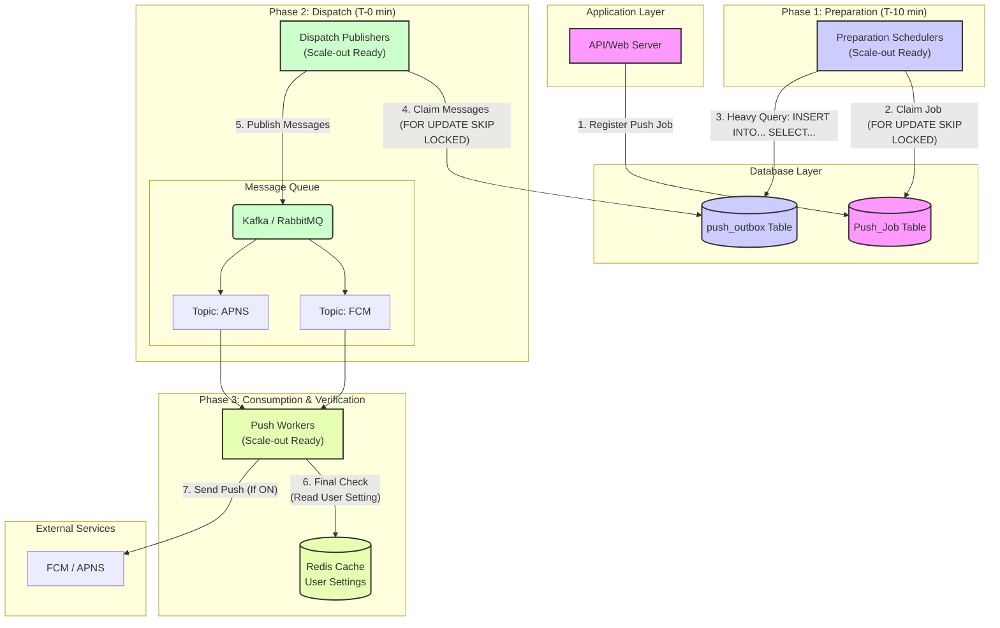
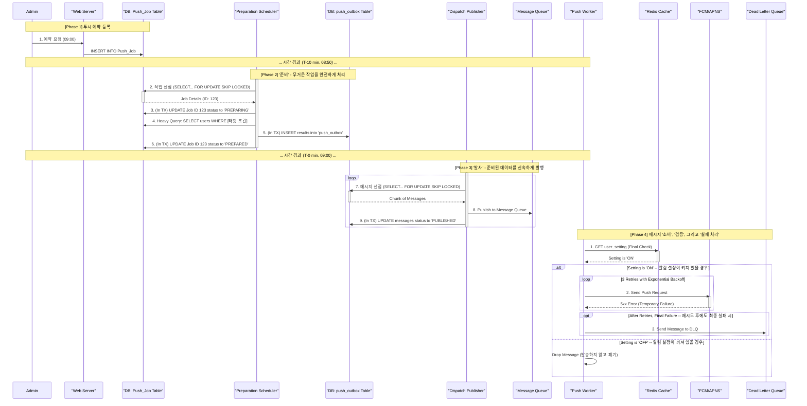

## 1. 도입

대규모 사용자 기반을 가진 애플리케이션에서 푸시 알림 시스템은 사용자 참여를 유도하고 중요한 정보를 전달하는 핵심적인 역할을 수행한다. 그러나 사용자 수가 증가함에 따라, 시스템은 대량의 메시지를 안정적이고 신속하게 처리해야 하는 기술적 과제에 직면하게 된다. 본 글에서는 과거 대규모 푸시 알림 시스템의 성능을 ThreadPool을 이용한 병렬 처리로 개선했던 경험을 복기하고, 당시의 기술적 한계를 현재의 관점에서 재평가하여 이를 극복하기 위한 새로운 아키텍처를 제안하고자 한다. 본 연구의 목표는 메시지 큐(Message Queue)와 아웃박스 패턴(Outbox Pattern)을 기반으로 한 차세대 비동기 처리 모델을 설계하여, 시스템의 처리량(Throughput), 안정성(Stability), 그리고 확장성(Scalability)을 획기적으로 개선하는 방안을 탐구하는 데 있다.

## 2. 기존 시스템의 문제 정의

본 연구의 대상이 되는 기존 시스템은 19만 명의 전체 사용자에게 알림을 발송하는 데 5시간 이상이 소요되는 성능 문제를 내포하고 있었다.

### 2.1. 1차 시스템: 단일 스레드 기반 동기 처리 모델

1차 시스템의 아키텍처는 단일 스레드가 페이징(Paging) 기법으로 사용자 정보를 순차 조회하고, 외부 푸시 서비스 API(e.g., FCM, APNS)를 동기적으로 호출하는 구조이다. 특히, 전체 발송 프로세스가 단일 데이터베이스 트랜잭션 내에서 실행되는 특징을 가진다.



이러한 구조는 다음과 같은 명확한 한계를 내포한다.

- 문제점 1: 직렬 처리와 동기 I/O 병목
각 API 호출마다 발생하는 I/O 대기 시간(Blocking)이 누적되어 전체 프로세스의 극심한 성능 저하를 유발한다.
- 문제점 2: 초장기 트랜잭션 (Long-Lived Transaction)
프로세스가 실행되는 수 시간 동안 데이터베이스 리소스에 장시간 락(Lock)이 설정될 수 있으며, 이는 시스템의 다른 부분에 대한 가용성 문제를 야기할 수 있다.
- 문제점 3: 구조적 취약성
단일 트랜잭션 모델은 프로세스 중간에 발생하는 단 한 번의 예외에도 전체 작업이 롤백(Rollback)되는 결과를 초래하여, 시스템의 안정성과 신뢰도를 저해한다.

### 2.2. 2차 시스템: 스레드 풀 기반 병렬 처리 모델

1차 시스템의 성능 한계를 극복하기 위해, 2차 시스템에서는 두 가지 핵심적인 최적화를 적용하였다. 가장 결정적인 개선은 외부 API의 Bulk 처리 방식 도입으로, 이는 네트워크 호출 횟수를 99% 이상 감소시켜 I/O 대기 시간을 획기적으로 줄였다. 이에 더하여, 스레드 풀(Thread Pool)을 이용한 병렬 처리 모델을 적용하여 최적화된 작업을 동시에 수행하도록 하였다.

#### 아키텍처:
1. (Bulk API 적용) 기존의 단일 사용자 호출 방식에서, 100명 단위로 푸시를 일괄 발송할 수 있는 Bulk API를 호출하는 방식으로 로직을 변경한다.
2. (병렬 처리) 시스템의 CPU 코어 수에 맞춰 스레드 풀을 생성하고, 메인 스레드가 조회한 사용자 청크(Chunk)를 각 작업 스레드에 할당하여 Bulk API 호출을 병렬로 실행한다.



이러한 병렬 처리 모델 도입을 통해, 시스템의 총 발송 시간은 5시간에서 30분으로 유의미하게 단축되었다.

#### 한계점:
성능 개선에도 불구하고, 2차 시스템은 여전히 1차 시스템과 동일한 근본적인 한계를 공유한다.

 - 문제점 1: 초장기 트랜잭션 및 DB 병목 지속
전체 발송 프로세스는 여전히 단일 트랜잭션 내에서 실행된다. 다수의 스레드가 동시에 데이터베이스의 공유 리소스에 접근하면서 경합이 발생하고, 이는 전체 처리량을 저하시키는 병목 현상을 유발하며, 초장기 트랜잭션 문제 또한 해결되지 않았다.
 - 문제점 2: 제한적인 확장성 (Vertical Scaling)
 성능은 단일 서버의 CPU 코어 수와 스레드 풀의 크기에 직접적으로 의존한다. 처리량을 높이기 위해서는 서버의 사양을 높여야 하는 수직적 확장(Vertical Scaling)만 가능하며, 여러 서버로 부하를 분산하는 수평적 확장(Horizontal Scaling)이 어려운 구조이다.
 - 문제점 3: 여전한 강한 결합도
 애플리케이션이 푸시 발송이라는 무거운 작업을 직접 수행하는 구조는 변하지 않았다. 이는 시스템의 복잡도를 높이고, 외부 API의 응답 지연이 스레드 풀 전체의 성능에 영향을 미치는 등 여전히 강한 결합도(Tight Coupling) 문제를 내포한다.

## 3. 제안하는 아키텍처: 비동기 메시지 기반 분산 처리 모델

기존 시스템의 한계를 극복하기 위해, 본 연구에서는 단순히 속도 개선을 넘어 **시스템의 안정성(Reliability), 확장성(Scalability), 데이터 정확성(Accuracy)** 까지 확보하는 것을 목표로 새로운 아키텍처를 제안한다.

핵심 전략은 시간이 오래 걸리는 '준비(Preparation)' 단계와 신속해야 하는 '발사(Dispatch)' 단계를 명확히 분리하고, 각 단계의 역할을 전문화된 컴포넌트에 위임하는 것이다. 전체 시스템의 구성은 아래 다이어그램과 같다.



### 3.1. 1단계: 준비 (Preparation) - 확장 가능한 안정적인 체크포인트 생성

정시성이 중요한 예약 발송 시스템에서, 발송 시점에 대규모 데이터를 조회하는 것은 지연을 유발할 수 있다. 이 문제를 해결하기 위해, **주기적으로 실행되며 수평 확장이 가능한 '준비 스케줄러(Preparation Scheduler)'** 를 도입한다.

여러 스케줄러 인스턴스가 동시에 실행되더라도, 각 인스턴스는 SELECT ... FOR UPDATE SKIP LOCKED LIMIT 1 구문을 사용하여 **경합 없이 하나의 작업만을 안전하게 선점(Claim)** 한다. 이는 데이터베이스의 내장 Lock 메커니즘을 활용하는 방식으로, 외부 분산 락을 사용하는 것보다 더 단순하고 효율적이며 트랜잭션의 원자성을 보장한다.

작업을 성공적으로 선점하면, 즉시 상태를 'PREPARING'으로 변경하고 메인 DB(필요시 Read Replica DB 사용)에 복잡한 타겟팅 쿼리를 실행한다. 그 결과는 push_outbox 테이블에 INSERT되며, 이 테이블은 실패 시 안전하게 재개할 수 있는 '체크포인트(Checkpoint)' 역할을 수행한다. 이 모든 과정은 하나의 원자적 트랜잭션으로 실행되어 데이터 정합성을 완벽하게 보장하며, 완료 후 Push_Job의 상태를 'PREPARED'로 변경한다.

**[동작 로직 요약]**

- Trigger: 매분 실행 (@Scheduled(cron = "0 * * * * *"))
- Query (Job Claiming): SELECT * FROM Push_Job WHERE status = 'SCHEDULED' AND scheduled_time <= NOW() + INTERVAL '10 MINUTE' FOR UPDATE SKIP LOCKED LIMIT 1
- Action (Atomic Transaction):
    1. 작업 상태를 PREPARING으로 변경
    2. INSERT INTO push_outbox SELECT ... 실행
    3. 작업 상태를 PREPARED로 변경

**[성능 검증] INSERT INTO ... SELECT 벤치마크**

'준비' 단계에서 실행되는 대규모 INSERT INTO ... SELECT 쿼리가 실제로 어느 정도의 성능을 내는지 확인하기 위해 간단한 벤치마크를 진행했다.

<details>
<summary>실행 쿼리</summary>

```sql
TRUNCATE TABLE push_outbox_benchmark;
-- 2. 쿼리 실행 및 분석
EXPLAIN ANALYZE INSERT INTO push_outbox_benchmark(user_id, device_token)
SELECT user_id, device_token 
FROM users_benchmark
WHERE notification_setting = 1;


-- 실행 2:
TRUNCATE TABLE push_outbox_benchmark;
EXPLAIN ANALYZE INSERT INTO push_outbox_benchmark(user_id, device_token)
SELECT user_id, device_token 
FROM users_benchmark
WHERE notification_setting = 1;


-- 실행 3:
TRUNCATE TABLE push_outbox_benchmark;
EXPLAIN ANALYZE INSERT INTO push_outbox_benchmark(user_id, device_token)
SELECT user_id, device_token 
FROM users_benchmark
WHERE notification_setting = 1;
```

</details>

실험 결과:
    100만 건의 users 테이블에서 특정 조건을 만족하는 80만 건의 데이터를 push_outbox 테이블로 복사하는 벤치마크를 3회 실행한 결과는 다음과 같다.
    
| 실행 횟수 | 소요 시간 (ms) | 처리된 Row 수 |
| :-------: | :------------: | :-------------: |
|   1회차   |    1213 ms     |     800,000     |
|   2회차   |    1195 ms     |     800,000     |
|   3회차   |    1197 ms     |     800,000     |
|  **평균**   |   **~1.2초**   |   **800,000**   |

<details>
<summary>실행 계획 결과</summary>

```text
-> Insert into push_outbox_benchmark
    -> Index lookup on users_benchmark using idx_notification_setting (notification_setting = 1)  (cost=70275 rows=494009) (actual time=0.0504..1213 rows=800000 loops=1)

-> Insert into push_outbox_benchmark
    -> Index lookup on users_benchmark using idx_notification_setting (notification_setting = 1)  (cost=69889 rows=494009) (actual time=0.0176..1195 rows=800000 loops=1)

-> Insert into push_outbox_benchmark
    -> Index lookup on users_benchmark using idx_notification_setting (notification_setting = 1)  (cost=70280 rows=494009) (actual time=0.0181..1197 rows=800000 loops=1)
```







</details>

EXPLAIN ANALYZE 실행 계획을 통해, 이 과정에서 notification_setting에 생성된 인덱스가 효과적으로 사용되었음을 검증하였다.

결과 분석: 
    이 벤치마크 결과는, 수십만 건의 대규모 데이터를 처리하는 '준비' 단계가 수 초 내에 완료될 수 있는 매우 빠른 작업임을 실증적으로 보여준다. 따라서, 이 단계가 전체 푸시 발송 시스템의 병목이 될 가능성은 낮다고 판단할 수 있다.


### 3.2. 2단계: 발사 (Dispatch) - 메시지 큐를 통한 작업 분산

'준비' 단계가 완료되면, **'발사 발행기(Dispatch Publisher)'**가 동작하여 체크포인트(push_outbox 테이블)에 저장된 데이터를 실제 실행 큐로 안전하게 옮기는 역할을 수행한다.

'준비 스케줄러'와 마찬가지로, 이 발행기 역시 주기적으로 실행되며 수평 확장이 가능하다. 여러 발행기 인스턴스는 SELECT ... FOR UPDATE SKIP LOCKED 구문을 사용하여 push_outbox 테이블의 데이터를 경합 없이 나누어 읽어온다.

발행기는 읽어온 데이터를 Kafka 또는 RabbitMQ와 같은 메시지 큐에 발행(Publish)하여, 실제 발송이라는 무거운 작업을 다수의 소비자(Consumer)에게 안전하게 분산시킨다. 이 방식은 DB를 작업 큐로 사용하는 것에서 완전히 탈피하여, 대규모 메시지 처리에 최적화된 전문 시스템에 역할을 위임하는 것을 의미한다.

SELECT ... FOR UPDATE SKIP LOCKED를 사용하는 '발사' 단계의 DB 작업은 매우 가볍고 빠르다. 이 단계의 전체 처리량은 데이터베이스가 아닌 메시지 큐의 수신 성능에 의해 결정되며, Publisher 인스턴스의 수를 늘리는 것만으로 손쉽게 수평 확장이 가능하므로 아키텍처의 주된 병목 지점으로 고려되지 않는다.

    - 플랫폼별 Topic 분리: 이 단계에서 발행기는 사용자의 플랫폼(FCM, APNS 등)을 확인하고, 각각에 해당하는 별도의 Topic으로 메시지를 발행한다. 이는 플랫폼 간의 장애가 서로에게 영향을 주지 않도록 시스템을 격리하는 효과를 가진다.

### 3.3. 3단계: 소비 및 최종 검증 (Consumption & Verification)

각 Topic의 메시지는 독립된 '푸시 워커(Push Worker)' 그룹에 의해 처리된다. 이 워커 그룹은 인스턴스의 수를 조절하는 것만으로 전체 발송 처리량을 탄력적으로 조절할 수 있어, 시스템의 최종 성능을 결정하는 핵심적인 확장 포인트를 제공한다.

가장 중요한 것은, 워커가 푸시 API를 호출하기 직전에 수행하는 '최종 검증(Final Check)' 단계이다. '준비' 시점과 '발사' 시점 사이의 시간차로 인해 발생할 수 있는 데이터 불일치 문제(e.g., 사용자가 그 사이에 알림 설정을 끔)를 해결하기 위해, 워커는 Redis와 같은 고속 캐시에서 사용자의 현재 알림 설정을 조회한다. 설정이 ON인 경우에만 최종적으로 푸시를 발송함으로써, 시스템은 성능, 정시성, 그리고 데이터 정확성이라는 세 가지 목표를 모두 달성할 수 있다.

### 3.4. 트래픽 분산을 통한 안정성 확보

대규모 푸시 발송은 성공적으로 완료되더라도, 수많은 사용자가 동시에 앱을 실행하여 발생하는 접속 부하(Thundering Herd Problem)로 인해 서비스 전체의 장애를 유발할 수 있다. 제안하는 아키텍처는 이 문제에 대한 명확한 제어 포인트를 제공한다.

**'발사 발행기(Dispatch Publisher)'** 가 push_outbox에서 메시지 큐로 데이터를 발행하는 속도를 의도적으로 조절(Rate Limiting)하거나, user_id 해싱(user_id % N)을 통해 생성된 사용자 그룹별로 시차를 두어 발행하는 전략을 사용할 수 있다. 이를 통해 백엔드 서버에 가해지는 트래픽을 완만한 형태로 분산시켜, 푸시 발송으로 인한 2차 장애를 예방하고 서비스 전체의 안정성을 확보한다.

## 4. 시스템의 견고성(Robustness) 확보 방안

제안하는 분산 시스템이 안정적으로 동작하기 위해서는, 애플리케이션 로직의 실패뿐만 아니라 시스템을 구성하는 핵심 인프라의 장애에도 대비해야 한다.

### 4.1. 애플리케이션 수준의 실패 처리

외부 시스템 연동 시 발생 가능한 실패 상황에 대응하기 위한 전략은 다음과 같다.

- 지수 백오프 기반 재시도 (Exponential Backoff Retry): Push Worker가 외부 API 호출 시 일시적인 오류(e.g., 5xx HTTP Status)를 수신하면, 재시도 간격을 점진적으로 늘려가는 지수 백오프 알고리즘을 적용하여 시스템의 불필요한 부하를 방지하고 성공률을 높인다.
- 데드 레터 큐 (Dead Letter Queue, DLQ): 지정된 횟수 이상 재시도에 실패한 메시지(e.g., 영구적으로 유효하지 않은 토큰)는 별도의 DLQ로 격리한다. 이를 통해 실패 원인을 분석하고 후속 조치를 위한 데이터를 확보하며, 실패한 메시지가 전체 시스템을 방해하지 않도록 격리한다.

### 4.2. 인프라 수준의 단일 실패 지점(SPOF) 제거

본 아키텍처의 핵심 컴포넌트인 메시지 큐와 Redis 캐시가 단일 노드로 구성될 경우, 해당 노드의 장애는 전체 시스템의 중단으로 이어진다. 이를 방지하기 위해 각 컴포넌트의 고가용성(High Availability) 확보는 필수적이다.

- 메시지 큐 고가용성: Kafka 또는 RabbitMQ를 클러스터(Cluster) 모드로 구성한다. 여러 브로커 노드가 데이터를 복제하고 리더(Leader)를 선출하는 메커니즘을 통해, 일부 노드에 장애가 발생하더라도 데이터 유실 없이 메시징 서비스를 지속할 수 있다.
- Redis 캐시 고가용성: Push Worker의 최종 검증 단계에서 의존하는 Redis 역시 센티넬(Sentinel)을 이용한 주/부 복제(Master/Replica) 또는 클러스터(Cluster) 모드로 구성한다. 마스터 노드 장애 시, 센티넬이 자동으로 부 노드를 새로운 마스터로 승격시키는 장애 극복(Failover)을 통해 캐시 서비스의 중단을 방지한다.

이러한 애플리케이션 및 인프라 수준의 견고성 확보 방안을 전체 프로세스에 통합하면, 다음 시퀀스 다이어그램과 같이 완전한 형태의 데이터 흐름이 완성된다.

이 다이어그램은 초기 예약 등록부터 시작하여, '준비', '발사' 단계를 거쳐, 최종 '소비' 단계에서 발생하는 재시도(Retry) 및 데드 레터 큐(DLQ)로의 실패 처리까지의 모든 경로를 상세히 보여준다.



## 5. 결론 및 논의

본 글에서 제안한 메시지 큐 기반의 비동기 아키텍처는 기존 시스템의 DB I/O 병목 문제를 해결하고, 각 컴포넌트의 독립적인 확장을 가능하게 하여 대규모 트래픽에 효과적으로 대응할 수 있는 기반을 마련한다. 또한, 실패 처리 메커니즘을 통해 시스템의 안정성과 데이터 무결성을 보장한다.

물론, 제안된 아키텍처는 메시지 큐 도입에 따른 운영 복잡성 증가 및 최종 일관성(Eventual Consistency) 모델에 대한 이해가 필요하다는 트레이드오프가 존재한다. 그럼에도 불구하고, 비즈니스의 성장에 따라 유연하게 확장할 수 있는 기술적 토대를 마련한다는 점에서 그 효용성은 매우 높다고 판단된다. 향후 연구로는 각 플랫폼별 최적의 Bulk 처리 단위 및 소비자 인스턴스 개수를 산출하기 위한 성능 벤치마크 테스트가 필요하다.

**현실적인 제약과 점진적인 아키텍처 진화**

본 글에서 제안한 아키텍처의 모든 컴포넌트에 고가용성(HA)을 즉시 적용하는 것은 현실적으로 복잡성과 비용 부담이 클 수 있다. 하지만 고가용성이 확보되지 않더라도, 이 아키텍처는 점진적으로 도입하며 큰 가치를 얻을 수 있다.

단일 노드(Single-Node)로 시작하더라도, push_outbox를 이용한 체크포인트 메커니즘은 MQ 장애 시 데이터 유실을 방지하는 핵심적인 안전장치 역할을 한다. 이는 일시적인 서비스 중단은 감수하더라도, 데이터의 정합성과 회복 가능성을 확보하는 현실적인 트레이드오프이다.

이후 서비스의 중요도와 규모가 커짐에 따라, Redis에 센티넬(Sentinel)을 도입하고 MQ를 클러스터로 전환하는 방식으로 점진적으로 시스템의 가용성을 높여나가는 '아키텍처 진화(Architectural Evolution)' 전략을 취하는 것이 바람직하다. 완벽한 아키텍처를 한 번에 구축하기보다, 비즈니스의 요구사항에 맞춰 시스템을 점진적으로 성숙시키는 것이 더 현명한 접근법일 수 있다.